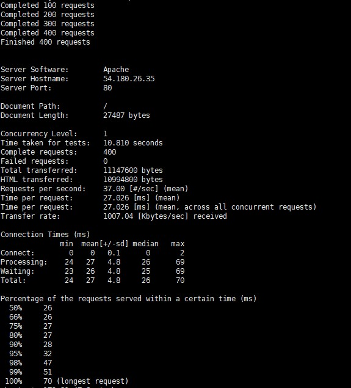

# AWS

## 필요 목적

- 분석해야할 데이터처리가 약 1년 정도 걸린다고 할때 많이 비효율 적이다. 그래서 클라우드 컴퓨팅을 이용해 내가 아닌 인터넷을 통해서 데이터 처리를 하기 위해 사용된다.

## 보안

- 실수 하면 돈이 많이 나가기 때문에 보안 설정을 미리 해두는 것이 좋다.

> 2단계 인증 설정

- 가상 MFA 디바이스 설정을 통해 QR코드를 스캔해 주면 2단계 OTP 설정이 가능하다.

## 지역(Region)

- 아마존 컴퓨터의 거리가 멀면 멀수록 네트워크의 속도가 떨어질 수 밖에 없다 그래서 지역을 선정하는 것은 중요한 과정이다.
- 그래서 각 국의 클라우드 핑을 확인해서 지역을 선정하면 좋다.
- 지역과 지역은 인터넷으로 연결 되어 있기 때문에 데이터를 주고 받기에는 느리기 때문에 효율이 않좋다.

### 가용영역 (AZ)

- AZ는 하나의 지역에 여러개가 필요하다 왜냐하면 지역에서 오류가 발생하면 백업 즉 안전장치 기능을 해야하기 때문이다.
- AZ는 네트워크가 아닌 전용 선으로 연결 되어 있기 때문에 여러개의 AZ가 분포되어 있더라도 하나의 AZ처럼 사용할 수 있다.

## 클라우드 컴퓨터

### EC2

#### 정의

- 구글 에서 가장 처음으로 만든 클라우드 컴퓨터 이다.
- 가상의 독립된 컴퓨터를 통째로 임대해준다.

#### 지역 설정

-  첫번째로 지역(Region)을 설정해야 한다

#### 인스턴스

- 1개의 인스턴스는 1개의 컴퓨터 이다

#### 인스턴스 설정 방법

1. AMI 선택
   1. 사용할 OS를 사용한다.
2. 인스턴스 유형 선택
   1. 임대할 컴퓨터의 사양을 선택
   2. 프리티어 고객이라면 프리티어 전용 사양만 선택 할 수 있다.
   3. 사용 할 수 있는 가상의 부품
      1. vCPUs
         1. CPU는 명개를 사용 할 것인가
      2. 메모리
         1. 메모리는 몇 기가를 사용 할 것 인가.
   4. m , c
      1. 유형들 중 m으로 시작하는 것은 메모리 기반으로 데이터를 처리할때 유용한것
      2. 유형들 중 c로 시작하는것은 cpu 기반으로 데이터를 처리할 때 유용한 것

>#### 인스턴스 요금 정책
>
>#####  온디맨드 요금
>
>- 필요할때 켜고 끄는 방식
>
>- 사용량에 따라 과금이 부여되므로 유심히 봐야할 카테고리이다.
>
>##### 예약 인스턴스
>
>- 만약 서버를 1년 동안 끄지 않고 사용한다면 할인 받을 수 있는 서비스 이다.
>
>##### 스팟 인스턴스
>
>- 전 세계에서 사용하지 않는 컴퓨터가 있을 경우 저럼한 가격으로 사용 할 수 있는 서비스이다. 즉 가격이 주가 처럼 왔다 갔다 한다.

#### 인스턴스 세부 설정

- 인스턴스 개수
  - 만들 컴퓨터의 갯수를 만들 수 있는 기능
- 네트워크 설정
  - 네트워크 설정을 사용자 입맛 대로 설정 할 수 있다.
- 종료 방식
  - 중지
    - 스토리지 부분의 요금만 정지 되고 인스턴스 요금은 늘어난다.
  - 종료
    - 인스턴스가 날라간다.

#### 스토리지  추가

- 사용 컴퓨터의 스토리지를 설정할 수 있다.

#### 태그 추가

- 인스턴스의 설명을 작성 할 수 있는 항목

#### 보안 그룹 구성

- 인스턴스에 접근 할때 보안 설정을 해주는 항목
  - SSH
    - 만들고 있는 인스턴스가 Linux라면 원격 제어로 사용 할 수 있도록 SSH로 설정 해 놔야 한다.
  - HTTP
    - 웹 브라우저에서 가상 컴퓨터를 접속 하기 위해서 설정 해 주어야 한다.

#### 검토

- 인스턴스를 접근할때 비밀번호가 필요한데 로컬 스토리지에 저장되기 때문에 보안에 위험하긴 하다.


#### Window에서 Linux 원격제어

- SSL가 없기 때문에 SSL을 사용하기 위한 프로그램을 사용해야 한다

프로그램

- XSHELL
- url = https://www.netsarang.com/ko/xshell/ 설치 방법 생략

> XSHELL
>
> - EC2 세션 등록 방법
>   - 열기를 클릭하여 세션을 만들어 준다
>   - 세션을 만들때 EC2 연결 설명서에 명시되어 있는 ip주소와 다운 받아놓은 패스워드를 설정해준다.
>   - 그리고 연결을 하면 "Welcom to ubuntu" 라는 메세지와 함께 연결을 확인 할 수 있다.


#### Linux에서 웹서버 사용

- XSHELL을 이용해서 ubuntu 가상머신에 접속한다
- 접속을 했으면 apache2를 설치해준다

```shell
sudo apt-get apache2
```

- 접속이 안된다면 ubuntu를 최신버전으로 update해준다

```shell
sudo apt-get update
```

- 해준다음 AWS에서 EC2 를 인스턴스 할때 생성된 도매인을 window에서 접속 해준다면 접속이 잘되는 것을 볼 수 있다.

#### AMI 사용

- 해당 인스턴스를 이미지화 시키는 기능

##### 사용방법

- 개발 하던 인스턴스를 이미지화 시킨다
- 이미지화를 시켰으면 그 이미지를 토대로 인스턴스를 하나 더 만들어 준다
- 만든 인스턴스는 이미지 화 된 인스턴스를 참조 하는 것이므로 이미지 화된 인스턴스의 기능을 사용할 수 있다.

#####  기대효과

- 인스턴스에서 작업을 하다가 오류가 날꺼 같은 코드를 작성 했다면 해당 인스턴스를 이미지화 시키고 이미지화 시킨 인스턴스를 토대로 인스턴스를 만들어서 테스트를 한다면 오류가 나더라도 이미지로 다시 돌아가 작업할 수 있는 기능을 사용할 수 있다.

#### scalability

##### 가상화

- 컴퓨터 구조상 컴퓨터는 다름과 같이 이루어져 있다
  - 물리적기계(Computer)
  - 운영체제(OS)
  - 가상머신
  - 가상머신 위에 여러가지 운영체제를 가질 수 있다
- 가상 머신의 종류
  - VMWare
  - VirtualBox
  - Parallels
- 장점
  -  스타트업
    - 저렴한 가상 컴퓨터를 사용하여 비용을 줄일 수 있다.
    - 동시접속자가 적은 회사
  - 엔터프라이즈
    - 좋은 cpu와 몇백기가의 메모리를 단 1분만에 만들어 준다.
  - **사용자 접속량에 따라 컴퓨터 비용을 유연하게 채택할 수 있다.**

#### scalability EC2에서 사용하기

##### Scale Up

트레픽 처리를 하기위한 기술

- 컴퓨터 수용량이 늘면 자동으로 성능을 높이는 기술 
- 준비물
  - 인스턴스가 두개 필요하고 하나는 공격 , 하나는 수비를 하여 실습 한다.

```shell
sudo atp-get install apache2-utils
```

을 통해 ab라는 트레픽을 발생 시키는 라이브러리를 사용한다

- ab가 주로 사용하는 명령어

  - -n

    - 몇 명을 사용자가 접속 하겠느냐

    - ```shell
      ab -n 500 http://localhost:5000/
      ```

  - -c

    - 한번에 몇번 접속하겠느냐

    - ```shell
      ab -c 1 http://localhost:5000/
      ```

그래서 트레픽 처리를 하기 위해 wordpress에 접속을 시도 한다

```shell
ab -n 400 -c 1 http://wordpress.ip/
```

- ab 
  - 트레픽 처리를 할 것이다
- -n 400
  - 400 횟수로
- -c 1
  - 한번에 한개식
- http://wordpress.ip/
  - 다음 주소로

접속이 끝나면 결과를 나타내 준다




결과를 테이블로 나타낸다면

- Time taken for tests
  - 방문자 처리 속도
- Fauled requests
  - 실패된 횟수
- Requests per second
  - 초당 방문자 처리 횟수
- Time per request
  - 1명당 처리 속도


````shell
ab -n 400 -c 2 http://wordpress.ip/
````

```shell
ab -n 400 -c 10 http://wordpress.ip/
```

```shell
ab -n 400 -c 50 http://wordpress.ip/
```

```shell
ab -n 400 -c 100 http://wordpress.ip/
```

```shell
ab -n 400 -c 100 http://wordpress.ip/
```


| 요청 | 동시접속 | 총소요시간 | 실패 | 초당처리속도 | 개별처리속도(초) |
| ---- | -------- | ---------- | ---- | ------------ | ---------------- |
| 400  | 1        | 10.810     |      | 37.00        | 0.027026         |
| 400  | 2        | 10.074     |      | 39.70        | 0.050372         |
| 400  | 10       | 10.204     |      | 39.20        | 0.225089         |
| 400  | 20       | 10.014     |      | 39.94        | 0.500695         |
| 400  | 50       | 9.995      |      | 40.02        | 1.249338         |
| 400  | 100      | 10.268     |      | 38.96        | 2.567017         |
| 400  | 200      | 10.301     |      | 38.83        | 5.150318         |

