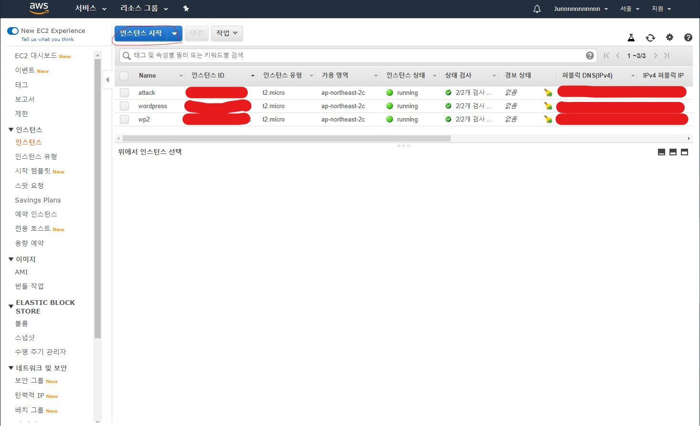
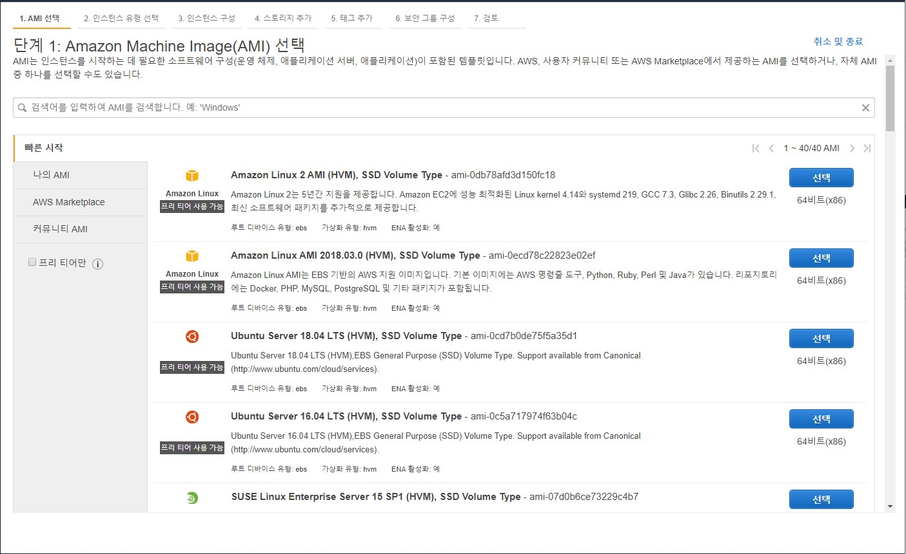

# EC2

## 정의

- 구글 에서 가장 처음으로 서비스한 클라우드 컴퓨터 이다.
- 가상의 독립된 컴퓨터를 개발자가 설정한 성능으로 임대해준다.

## 지역 설정

-  첫번째로 지역(Region)을 설정해야 한다

## 인스턴스

- 1개의 인스턴스는 1개의 컴퓨터의 개념이다.

### 인스턴스 설정 방법

인스턴스 시작을 클릭한다.

1. AMI(OS 이미지) 선택
   
   
   
   1. 사용할 OS를 사용한다.
   2. 개인적으로 웹 서버를 구현하기 좋은 OS는 ubuntu라고 생각한다 왜냐하면 프로세스 관리도 쉽고 curl 구현도 잘되 있을 뿐만 아니라 window보다 GUI의 구성이 적기 때문에 가볍다는 장점이 있다.
   
2. 인스턴스 유형 선택

   

   1. 임대할 컴퓨터의 사양을 선택
   2. 프리티어 고객이라면 프리티어 전용 사양만 선택 할 수 있다.
   3. 사용 할 수 있는 가상의 부품
      1. vCPUs
         1. CPU는 몇개를 사용 할 것인가
      2. 메모리
         1. 메모리는 몇 기가를 사용 할 것 인가.
   4. m , c
      1. 유형들 중 m으로 시작하는 것은 메모리 기반으로 데이터를 처리할때 유용한것
      2. 유형들 중 c로 시작하는것은 cpu 기반으로 데이터를 처리할 때 유용한 것

>### 인스턴스 요금 정책
>
>####  온디맨드 요금
>
>- 필요할때 켜고 끄는 방식
>
>- 사용량에 따라 과금이 부여되므로 유심히 봐야할 카테고리이다.
>
>### 예약 인스턴스
>
>- 만약 서버를 1년 동안 끄지 않고 사용한다면 할인 받을 수 있는 서비스 이다.
>
>### 스팟 인스턴스
>
>- 전 세계에서 사용하지 않는 컴퓨터가 있을 경우 저럼한 가격으로 사용 할 수 있는 서비스이다. 즉 가격이 주가 처럼 왔다 갔다 한다.

### 인스턴스 세부 설정

- 인스턴스 개수
  - 만들 컴퓨터(인스턴스)의 갯수를 만들 수 있는 기능
- 네트워크 설정
  - 네트워크 설정을 사용자 입 맛대로 설정 할 수 있다.
- 종료 방식
  - 중지
    - 스토리지 부분의 요금만 정지 되고 인스턴스 요금은 늘어난다.
  - 종료
    - 인스턴스가 삭제 된다 그래서 인스턴스에 대한 요금과 스토리지 부분의 요금이 과금 되지 않는다.

#### 스토리지  추가

- 사용 컴퓨터의 스토리지(저장 용량)를 설정할 수 있다.

#### 태그 추가

- 인스턴스의 설명을 작성 할 수 있는 항목
- Key / value
  - key
    - Name으로 설정하면 value값이 aws 인스턴스 카테고리 GUI에 표시된다
  - value
    - 표시될 이름

#### 보안 그룹 구성(중요)

- 인스턴스에 접근 할때 보안 설정을 해주는 항목
  - SSH
    - 만들고 있는 인스턴스가 Linux라면 원격 제어로 사용 할 수 있도록 SSH로 설정 해야 한다.
  - HTTP
    - 웹 브라우저에서 가상 컴퓨터를 접속 하기 위해서 설정 해 주어야 한다.

#### 검토

- 인스턴스를 접근할때 비밀번호가 필요한데 로컬 스토리지에 저장되기 때문에 보안에 위험하다.