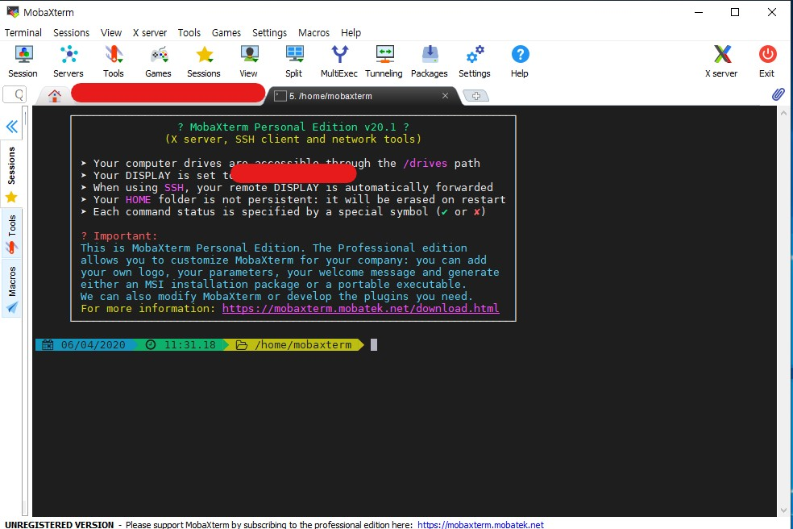

# EC2에 Spring web 서버 환경 구축하기

## 개요

- 웹 페이지를 만들고 사람들이 웹 페이지에 들어와서 다양한 활동을 하기 위해서는 웹을 서버(tomcat)에 올려야한다. 그러나 서버를 켜놓기 위해서는 컴퓨터를 항상 24간 켜놔야 한다는 불편함이 있다. 그것을 가상 머신인 ec2를 서버용 컴퓨터로 만들면 간단하게 해결 된다.

## 환경

- jdk-11.0.5
- ubuntu 16.04
- tomcat8

## 실습

### jdk11 다운받기

- spring을 로컬에서 jdk11버전으로 코딩을 했기때문에 서버에도 이와 같은 버전의 jdk를 사용해야 한다.

#### Oracl 홈페이지에서 jdk 다운 받기

- 다음 사이트에서 리눅스용 tar.gz파일을 다운 받는다. https://www.oracle.com/java/technologies/javase/jdk11-archive-downloads.html


- 설치를 받으면 다음과 같이 압축 파일이 생긴다


### mobaXterm

- 로컬에서 받은 jdk11파일을 가상 머신인 ec2에 옮겨야 하는데 이때 scp를 이용해 파일을 옮기는 것이 보통 사용 방식이다. 그러나 터미널을 사용해서 파일을 옮기기에는 손도 많이가고 복잡하다 그래서 GUI기반의 터미널인 mobaXterm응 사용해서 Dreg & Drop 형식으로 파일을 가상머신으로 옮기자

#### mobaXterm 설치

- https://mobaxterm.mobatek.net/ 에서 window용 파일을 다운 받고 설치한다.


- 설치가 완료되면 다음과 같은 응용프로그램이 나온다



- 프로그램의 왼쪽 상단에 Session을 가상머신을 등록 해두자


- Remote host 에는 가상머신의 도메인 주소
- Secure Shell (SSH ) session에는 aws에서 받아 놓은 pem(pair key)를 등록 한다.


- OK를 누르면 다음과 같이 login as 라는 입력란이 나오고 아이디인 ubuntu를 입력하면 Welcome 과 함께 원격접속에 성공 한다.


### mobaXterm을 사용해서 ec2에 jdk11 설치하기

- jdk11을 Dreg & Drop으로 가상 머신으로 jdk11을 이동 시킨다.


- 이동시키면 경로는 /home/ubuntu/ 라는 사용자 계정에 이동이 된다.

```shell
$tar -xvf jdk-11.0.5_linux-x64_bin.tar.gz
```

- 그 이후 `sudo su` 를 사용해 root계정으로 바꾸고 압축 파일을 풀고 싶은 곳으로 가서 압축을 푼다 
- 경로는 /bin/otp로 지정해 두었다
- JAVA압축을 풀었으면 PATH 지정을 한다 패스를 지정하는 파일은 /etc/profile 이다.

```shell
$nano /etc/profile
```

- nano는 vi,vim처럼 문서를 edit하는 좋은 도구 이다.

/etc/profile

```shell
# /etc/profile: system-wide .profile file for the Bourne shell (sh(1))
# and Bourne compatible shells (bash(1), ksh(1), ash(1), ...).

if [ "${PS1-}" ]; then
  if [ "${BASH-}" ] && [ "$BASH" != "/bin/sh" ]; then
    # The file bash.bashrc already sets the default PS1.
    # PS1='\h:\w\$ '
    if [ -f /etc/bash.bashrc ]; then
      . /etc/bash.bashrc
    fi
  else
    if [ "`id -u`" -eq 0 ]; then
      PS1='# '
    else
      PS1='$ '
    fi
  fi
fi

if [ -d /etc/profile.d ]; then
  for i in /etc/profile.d/*.sh; do
    if [ -r $i ]; then
      . $i
    fi
  done
  unset i
fi
export JAVA_HOME=/bin/opt
export PATH=$JAVA_HOME/bin/:$PATH
export CLASS_PATH=$JAVA_HOME/lib:$CLASS_PATH
```

- 다음과 같은 파일이 있는데
  - `export JAVA_HOME=/bin/opt`
    - 프로그램을 실행시키기 위한 JAVA Path위치를 JAVA_HOME 으로 설정
  - ` export PATH=$JAVA_HOME/bin/:$PATH` 
    - 변수 생성한 JAVA_HOME을 PATH에 추가
  - `export CLASS_PATH=$JAVA_HOME/lib:$CLASS_PATH`
    - 라이브러리를 읽기 위해 CLASS_PATH를 사용


- 자바가 잘 깔려있는지 확인 하기 위해 `javac`의 버전을 확인다.


- 확인이 잘 된다 허허


### Tomcat 설치

Spring의 war파일을 배포할 것이기 때문에 Tomcat설치를 해야한다. 버전은 8을 사용 할 것이다.

```shell
$apt-get update
$apt-get install tomcat8
```

- apt-get 을 통해 update와 tomcat8을 설치 한다.

```shell
/usr/share/tomcat8/bin/version.sh
```

- tomcat의 version 체크 한다.

그리고 ec2에 보안설정에 인바운드 규칙을 추가하는데 ec2에서 tomcat을 사용하기 위해서는 8080포트를 열어 줘야 한다.


### Spring boot에서 war배포 하기

war란 웹 어플리케이션 아카이브로서 웹 어플리케이션을 저장해 놓은 곳이다.

그 곳에는 개발한 웹 어플리케이션이 was에서 구동 될수 있도록 되어 있으며 서블릿, 빈 클레스, jsp등  소스가 컴파일되서 저장되는 곳이다.


- maven을 clean해주고 complie을 하면 target에 war파일이 생긴다.


다음과 같이 war파일이 생긴다.

위에 war파일은 임시적으로 보여주기 위해 그런거고 실제 war파일 이름은 **RDS_version1**이다.

이 war파일을 웹 서비스 호스팅 서버(Ec2)에 옮긴다. 옮기는 파일위치는 tomcat8 디렉토리안에 있는 webapps이다.


다음과 같이 옮겨져 있다.

그리고 

```shell
$ service tomcat8 start
```

tomcat을 시작하면 war파일이 자동으로 풀리면서 RDS_version1 디렉토리가 생기면서 ip:8080으로  개발해놓은 웹 어플리케이션이 실행 된다.

그러나 그냥 톰켓을 실행 시키면 root path가 / 가아닌 war 패키지 명으로 되어 있다. 예를들면

`www.ip_address:8080/RDS_version1`와 같이 되있어서 root path를 변경해 줘야 기능들이 정상적으로 처리 된다.


변경을 하기 위해서 tomcat8의 conf폴더에 server.xml을 수정해 주면 된다.

```shell
$ nano tomcat 설치 경로/tomcat8/conf/server.xml
```

- server.xml 내용중 수정해 줘야할 곳은 HOST 태그 안에 Context태그의 속성값을 변경해주면 해결끝!

````xml
<Host name="localhost"  appBase="webapps"
            unpackWARs="true" autoDeploy="true">
        <Context docBase="RDS_version1" path="/" reloadable="true"></Context>
</Host>

````

- 위 코드와 같이 Context태그를 만들어 주고 속성값으로 docBase를 war 패키지명으로 , path는 / 로 설졍 해두면 이제 root path는 / 로 사용할 수 있습니다.