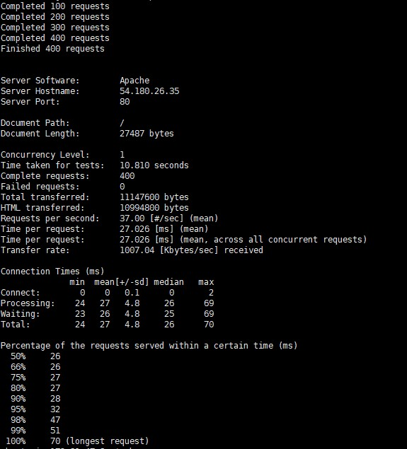

# Scale UP

트레픽 처리를 하기위한 기술

- 컴퓨터 수용량이 늘면 자동으로 성능을 높이는 기술 
- 준비물
  - 인스턴스가 두개 필요하고 하나는 공격 , 하나는 수비를 하여 실습 한다.

```shell
sudo atp-get install apache2-utils
```

을 통해 ab라는 트레픽을 발생 시키는 라이브러리를 사용한다

- ab가 주로 사용하는 명령어

  - -n

    - 몇 명을 사용자가 접속 하겠느냐

    - ```shell
      ab -n 500 http://localhost:5000/
      ```

  - -c

    - 한번에 몇번 접속하겠느냐

    - ```shell
      ab -c 1 http://localhost:5000/
      ```

그래서 트레픽 처리를 하기 위해 wordpress에 접속을 시도 한다

```shell
ab -n 400 -c 1 http://wordpress.ip/
```

- ab 
  - 트레픽 처리를 할 것이다
- -n 400
  - 400 횟수로
- -c 1
  - 한번에 한개식
- http://wordpress.ip/
  - 다음 주소로

접속이 끝나면 결과를 나타내 준다




결과를 테이블로 나타낸다면

- Time taken for tests
  - 방문자 처리 속도
- Fauled requests
  - 실패된 횟수
- Requests per second
  - 초당 방문자 처리 횟수
- Time per request
  - 1명당 처리 속도


````shell
ab -n 400 -c 2 http://wordpress.ip/
````

```shell
ab -n 400 -c 10 http://wordpress.ip/
```

```shell
ab -n 400 -c 50 http://wordpress.ip/
```

```shell
ab -n 400 -c 100 http://wordpress.ip/
```

```shell
ab -n 400 -c 100 http://wordpress.ip/
```


| 요청 | 동시접속 | 총소요시간 | 실패 | 초당처리속도 | 개별처리속도(초) |
| ---- | -------- | ---------- | ---- | ------------ | ---------------- |
| 400  | 1        | 10.810     |      | 37.00        | 0.027026         |
| 400  | 2        | 10.074     |      | 39.70        | 0.050372         |
| 400  | 10       | 10.204     |      | 39.20        | 0.225089         |
| 400  | 20       | 10.014     |      | 39.94        | 0.500695         |
| 400  | 50       | 9.995      |      | 40.02        | 1.249338         |
| 400  | 100      | 10.268     |      | 38.96        | 2.567017         |
| 400  | 200      | 10.301     |      | 38.83        | 5.150318         |


## 탄력적 ip사용하기

- 위 상황과 같이 트레픽이 많아지면 하드웨어 적인 부분과 소프트웨어적인 부분을 fix해야 한다. 일단 하드웨어 적인 부분을 fix해 보겠다.
- 기본적으로 트레픽이 생기는 이유는 컴퓨터의 사양이 않좋을 때 발상핸다 그래서 인스턴스의 사양을 높혀서 사용해야 한다
- 인스턴스의 사양 업그래이드는 기존의 인스턴스의 접속을 끊고 업그레이드된 인스턴스로 접속을 해야한다 그때 ip는 기존의 ip를 삭제하고 새로운 아이피로 대체된다. 왜냐하면 ip는 0.0.0.0 에서 256.255.255.255로 이루어 져있기 때문에 전세계에서 ip를 약 40억개 사용할 수 있다. 그래서 인스턴스 연결을 끊으면 한 사람이 그 ip를 사용하고 인스턴스를 다시 접속 했을땐 사용하지 않는 ip를 할당 해준다. 그래서 문제점이 발생한다. 만약 1초에 만명이 들어오는 web site라고 가정하자 접속을 잠깐 끊는거 많으로도 많은 user가 불편함을 느껴야 한다.
- 그래서 사용하는게 탄력적 ip이다.


탄력적 ip는 고정아이피를 개발자에게 부여해주는 기능을 가지고 있다.

만약 기존의 인스턴스에 탄력적 ip를 부여했다고 가정하자 (12.13.16.15) 

기존의 인스턴스의 기능을 사용해야 하기 때문에 이미지 화를 시킨다. AMI에 등록되어 있는 기존 인스턴스 이미지를 다시 인스턴스로 만든다. 새로운 인스턴스는 scale up을 시켜줘야 하기 때문에 좋은 성능으로 만들어 준다.

이제 기존 인스턴스에서 새로운 인스턴스로 서비스를 바꿔야 한다. 원래라면 접속이 끊기고 새로 접속 할때 새로운 ip를 aws에서 부여하는데 탄력적 ip를 기존의 인스턴스가 아닌 바뀐 인스턴스로 연결해 준다면 아이피가 바뀌지 않고 서비스를 계속 진행 할 수 있다.

