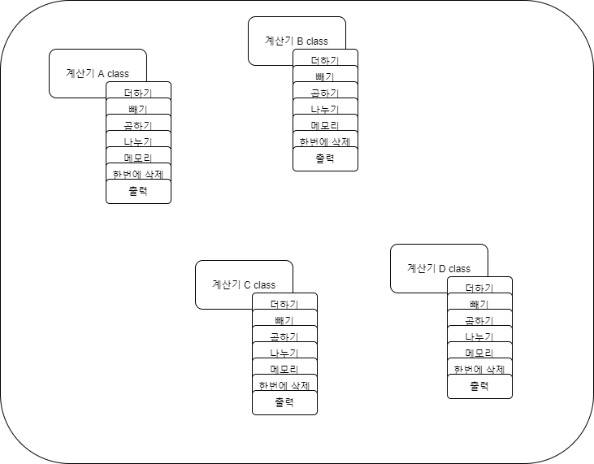

# 의존성 , 의존성 주입

## 의존성 

- 특정 클래스에서 **객체를 사용하기 위해서** new를 통한 인스턴스 생성으로 인해 강한 결합이 생기는 것

```java
class Calculator{
    Add add = new Add();
    
    public void addPrint(int a , int b){
        add.print(a , b);
    }
}


class Add{
    public void print(int a, int b){
        System.out.print(a + b);
    }
}
```

- `Calculator` 에서 인스턴스 생성한 `Add add = new Add();` 가 강한 결합 즉 **의존성**의 개념을 띈다.



- 계산기 class 를 인스턴스화하면 위 그림과 같이 한 계산기당 여러 객체를 인스턴스화 시켜 강한 결합을 이루고 있다.

## IOC

- IOC는 객체의 생성부터 소멸까지의 객체들을 관리한다. 즉 **bean**의 등록 된 객체들을 관리하기 때문에 **bean들의 라이프 사이클**을 관리한다고도 한다.
- **프로그래머가 직접 객체를 생성**하는 것을  IOC Container 에서 beanFactory에 등록 되어 있는  필요한 객체를 **setter로 주입**하는 **DI(Dependency injection)**역할을 한다


- **만약 DI를 사용하지 않았을때** 객체가 객체를 변수로 사용한다면 `Add add = new Add();` 과 같이 한번 사용할때 마다 new을 꼭 사용해줘야 한다. 그러나 **DI을 사용한다면** new 없이 **일반 변수처럼** `Add add;` 와 같이 객체를 사용 할 수 있다. **왜냐하면** Bean에서 관리하고 있는 객체들을 가져다 사용하기 떄문이다.

