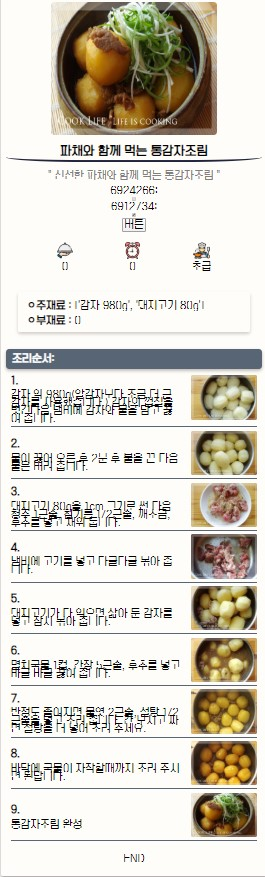

# Fetch api사용해서 db값 불러와 비동기로 앞단에 보여주기

## 개요

- 회원 전용으로 북마크기능을 추가하기 할것이다.

- **Fetch**를 사용한 이유는 북마크기능을 사용하기 위해서는 db에 사용자 정보를 통해 **bookmark** **table**에 레시피가 있는지 없는지, 만약 있다면 **select**문을 통해 **recipeID**를 가져오고, 가져온 **recipeID**를 통해 **recipe** **table**에 **recipeID**가 있는지 확인하고 **있다면** 레시피의 정보들을 가져오는 복잡한 로직으로 되어 있습니다.

  그렇기 때문에 요청과 응답을 **동기적으로** 한다면 앞단에서 데이터를 들고 올때 **버벅거림이** 있거나, **깜빡거림등이** 있어 깔끔하지 못합니다.

  그래서 **Fetch** **Api**를 통해 응답,요청을 **비동기화** 시켜서 **싱글** **페이지로** 북마크 기능을 사용할 수 있겠금 로직 구현하는것이 목표이다.

## 구현해야 할 기능

- **Fetch** **api**를 통해 **json** 데이터 **web** **server**로 보내기
- **web** **server**에서 `@RequestBody`를 통해 **json** 데이터 브라우저로 보내기
- 브라우저에서 동적으로 가저온 **json** 데이터 li로 찍기

## 구현

### Front-end


- 다음과 같이 재료에 대한 **detection**이 끝나고 레시피를 **추천해주는** 페이지이다.

  페이지를 보면 별표 모양이 있는데 저 **별표** 모양을 누르면 별표는 **노랑색으로** 변하고 `insertBookmark` **function**이 실행 된다.

  메서드의 로직은 다음과 같다.

> resultRecipe.js
>
> **funchtion insertBookmark(recipeID)**

```javascript
function insertBookmark(recipeID) {
    //console.log("recipeID", recipeID);
    const odj = {
        method: 'POST',
        body: JSON.stringify({userID: 0, recipeID: recipeID}),
        headers: {
            "Content-type": "application/json; charset=UTF-8"
        },
        credentials: 'same-origin'
    };
    //fetch를 사용할때 url과 odj로 GET ,POST 메서드를 설정해 준다.
    fetch("http://localhost:8080/insertBookmark", odj)
    //reponse를 가져와서
        .then(res => {
        //status가 200이라면
        if (res.status == 200) {
            //servlet에서 return된 json값을 가져 온다.
            res
                .json()
                .then(json => console.log(json.recipeIDList));
        }
    })
}
```

- **mariaDB**에 있는 **bookmark** **table**에 **userID**와 **recipeID**를 **insert** 하기위한 로직중 fetch를 통해 recipeID를 **json** 데이터로 만들어 `http://localhost:8080/insertBookmark` **URL**로 요청하는 로직이다.

  > ```javascript
  > const odj = {
  >     method: 'POST',
  >     body: JSON.stringify({userID: 0, recipeID: recipeID}),
  >     headers: {
  >         "Content-type": "application/json; charset=UTF-8"
  >     },
  >     credentials: 'same-origin'
  > };
  > ```

- odj 변수는 총 네가지 정보로 구성되어 있다.

  - **method**

    - **URL**요청시 **GET** 방식과 **POST**방식 둘중에 하나의 방식으로 요청을 보낼 수 있다.

  - **body**

    - **url**에 요청할때 보내지는 데이터를 의미 한다.
    - **recipeID**를 보내야 하기 때문에 **recipeID**를 **Json** 데이터로 만든뒤 보내는 로직을 구현했다

  - **headers**

    - 보낼 데이터의 타입을 지정해 줘야 **web** **server**에서 값을 받을 수 있다.
    - `"Content-type": "application/json; charset=UTF-8"`
      - **Content-type** : 보낼 데이터의 타입을 지정할 수 있다.
      - **application/json** : **json** 타입의 데이터를 보낸다.
      - **charset = UTF-8**  : 인코딩 형식은 **UTF-8**로 할 것이다.

  - **credential**

    -  사이트에서 사용자 세션을 유지 관리해야하는 경우 **인증되지 않는 요청이 발생**한다.

      그래서 자격 증명 옵션을 통해 보내질 데이터가 **인증 된 데이터인지 아닌지를 정해야** 한다.

    - **same-origin**을 사용하면 자격 증명 설정을 했다라는 의미이므로 안전하게 데이터를 보낼 수 있다라는 의미와 같다.

  > ```javascript
  > fetch("http://localhost:8080/insertBookmark", odj)
  >         .then(res => {
  >             if (res.status == 200) {
  >                 res
  >                 .json()
  >                 .then(json => console.log(json.recipeIDList));
  >       }
  >     })
  > ```

- `fetch()` 메서드에 **두개의** **파라미터를** 넘긴다.

  - **URL**
    - 요청 보낼 **URL** 주소
  - **odj**
    - `fetch()`의 **init** 정보

- `then()`메서드란  요청으로 인한 **응답이 왔을때 처리**되야 될 로직을 구현한다. 

  위 코드의 구성은 다음과 같다

  - `.then(res => ...)` 응답 결과가 **res** 변수에 초기화된다.
  - `if(res.status == 200)` **res**에 **status**가 200(응답 정상)이라면 
  - `(json => console.log(json.recipeIDList))` 응답 받은 데이터중 **json** 데이터가 존재 하고 그 **json** 데이터의 **key** 중 **recipeIDList**가 있다면 **console**에 찍어라 라는 뜻입니다.


### Back-end

- **web** **server에** 넘어온 **json** 데이터를 구현해 놓은 **bookmark** **table에** mapper를 통해 **insert** 시켜야 한다.

  로직은 다음과 같다.

> TestController.java
>
> **@RequestMapping(value="/insertBookmark", method=RequestMethod.POST)**

```java
 @RequestMapping(value="/insertBookmark", method=RequestMethod.POST)
    @ResponseBody public BookmarkVO insertBookmark(@RequestBody BookmarkVO resBody, @AuthenticationPrincipal SecurityUserInfo securityUserInfo) {
        //세션에 저장 되어 있는 id를 가져옴
        String userID = securityUserInfo.getUsername();
        //브라우저에서 json으로 넘어온 레시피 id를 int로 변환
        int recipeID = resBody.getRecipeID();
        //체크 되었는지 안되었는지 확인 할 수 있는 변수
        //db로 보낼 VO객체 생성
        BookmarkVO bookmarkVO = new BookmarkVO(userID, recipeID);
        
        if(bookmarkService.selectBookmark(bookmarkVO) != null){
            bookmarkService.deleteBookmark(bookmarkVO);
        }
        else{
            bookmarkService.insertBookmark(bookmarkVO);
        }
        System.out.println("userID: " + bookmarkVO.getUserID() + "recipeID: " + bookmarkVO.getRecipeID());
        System.out.println(bookmarkService.loadBookmark(userID));
        bookmarkVO.setRecipeIDList(bookmarkService.loadBookmark(userID));
        return bookmarkVO;
    }
```

- `RequestMapping(value="/insertBookmark",method=RequestMethod.POST)` 

  - **URL** 요청이 `rootPath/insertBookmark`로 오고 **method** 타입이 **POST일때** 다음 함수를 수행해라

- `@ResponseBody`란 `return` 값으로 얻은 데이터를 앞단에 **Body로** 찍어주는 방식도 있지만, 다음 로직은 **Fetch** **Api에서** `@ResquestMapping` 으로 요청받은 **데이터** **형태**(타입,접근권한 등)와(과) 맞춰 **json** 데이터를 응답 해주는 역할을 한다.

- `public BookmarkVO insertBookmark` 는 **BookmarkVO로** **return** 해주는 메서드이다 **BookmarkVO의** 로직구성은 다음과 같다

  >BookmarkVO.java
  >
  >```java
  >package com.multicampus.finalproject.model;
  >
  >import java.util.ArrayList;
  >import java.util.List;
  >
  >import lombok.Data;
  >
  >@Data
  >public class BookmarkVO {
  >    private String userID;
  >    private int recipeID;
  >    private List<Integer> recipeIDList;
  >    private List<RecommandListVO> recommandList;
  >
  >    public BookmarkVO(){}
  >    public BookmarkVO(String userID, int recipeID){
  >        this.userID = userID;
  >        this.recipeID = recipeID;
  >    }
  >}
  >```

  - 필드 변수로 받은 **userID와** **recipeID는** 앞단에서 받은 **json** 데이터 형식과 맞추기 위해서 이다
  - `List<RecommandListVO>` 는 **bookmark** **table의** **recipeID를** 통해 레시피 세부정보를 **다시** **앞단으로** 보내기 위한 변수인데 `loadBookmark` 함수에서 사용하기 떄문에 다음 함수 때 살펴보도록 한다.

- `insertBookmark` 메서드의 매개변수는 **두개가** 있는데 첫번째는 `@RequestBody` 로 받은 json 데이터를  `BookmarkVO`타입으로 받아준다. 

  두번째는 로그인 된 **유저의** **정보를** 가져올 수 있는 `@AuthenticationPrincipal SecurityUserInfo` 타입의 변수를 받아온다. `@AuthenticaionPricipal` 어노테이션과 `SecurityUserInfo`타입은 **Spring에서** 제공하는 **security** 라이브러리에서 제공한다.

- 앞단에서 json으로 요청받은 **데이터와** security 라이브러리로 가져온 **userID를** DB에 넣는 로직은 구성해야 한다. 그전에 `bookmarkServic.java`에서 사용할 메서드들이 있기 때문에 `bookmarkService.java`과 **Service에서** 사용할 **repository인** `UserMapper.java`의 로직 구성을 알아 보자

  >```java
  >package com.multicampus.finalproject.service;
  >
  >import java.util.ArrayList;
  >import java.util.HashMap;
  >import java.util.List;
  >
  >import com.multicampus.finalproject.model.BookmarkVO;
  >import com.multicampus.finalproject.repository.UserMapper;
  >
  >import org.springframework.beans.factory.annotation.Autowired;
  >import org.springframework.stereotype.Service;
  >
  >@Service
  >public class BookmarkService {
  >    
  >    @Autowired
  >    UserMapper userMapper;
  >
  >    public void insertBookmark(BookmarkVO bookmarkVO){
  >        userMapper.insertBookmark(bookmarkVO);
  >    }
  >    public BookmarkVO selectBookmark(BookmarkVO bookmarkVO){
  >        return userMapper.selectBookmark(bookmarkVO);
  >    }
  >    public void deleteBookmark(BookmarkVO bookmarkVO){
  >        userMapper.deleteBookmark(bookmarkVO);
  >    }
  >    public ArrayList<Integer> loadBookmark(String userID){
  >        return userMapper.loadBookmark(userID);
  >    }
  >}
  >```

  - Service에서 사용될 4가지 이다.

    - **bookmark** **table에** 원하는 데이터가 들어있는지 아닌지를 알기 위한 **select** 문
    - **bookmark** **table에** 데이터를 넣기 위한 **insert** 문
    - **bookmark** **table에** 는 user 한명이 **여러개의** **recipeID를** 가질 수는 있지만 한명이 **한개의** **recipeID를** 많이 가질 수는 없기 때문에 insert할 데이터가 bookmark table에 있다면 삭제해야 하는 **delete** 문
    - bookmark table에 있는 user별 recipeID 리스트를 가져오기 위한 **select문** 

    이렇게 **4가지로** 구성되어 있다. 

- `userMapper.java`는 **DB와** 직접적으로 데이터를 주고받는 **DAO이므로** **repository** 폴더에 따로 저장 시켜 놨다.

  - `userMapper.java`는 `Mapper.xml` 파일과 매핑 되어 있다. `Mapper.xml` 로직 구성은 다음과 같다.

  >```xml
  ><?xml version="1.0" encoding="UTF-8"?>
  ><!DOCTYPE mapper PUBLIC "-//mybatis.org//DTD Mapper 3.0//EN" "http://mybatis.org/dtd/mybatis-3-mapper.dtd">
  ><mapper namespace="com.multicampus.finalproject.repository.UserMapper">
  >    <select id="getAll" resultType="com.multicampus.finalproject.model.UserInfo">
  >        SELECT * FROM user;
  >    </select>
  >
  >    <select id="readUser" parameterType="String" resultType="com.multicampus.finalproject.model.UserInfo">
  >        SELECT * FROM user WHERE username = #{username}
  >    </select>
  >
  >    <select id="readAuthority" parameterType="String" resultType="String">
  >        SELECT authority_name FROM authority WHERE username = #{username}
  >    </select>
  >
  >    <select id="loadBookmark" parameterType="String" resultType="int">
  >        SELECT recipeid FROM bookmark WHERE userID = #{userID}
  >    </select>
  >
  >    <select id="selectBookmark" parameterType="com.multicampus.finalproject.model.BookmarkVO" resultType="com.multicampus.finalproject.model.BookmarkVO">
  >        select * from bookmark where userID = #{userID, jdbcType = VARCHAR} and recipeID = #{recipeID}
  >    </select>
  >
  >    <delete id="deleteBookmark" parameterType="com.multicampus.finalproject.model.BookmarkVO">
  >        delete from bookmark where userID = #{userID} and recipeID = #{recipeID};
  >    </delete>
  >
  >    <insert id="insertMember" parameterType = "com.multicampus.finalproject.model.UserInfo">
  >        INSERT INTO `user` (`username`, `password`, `name`, `isAccountNonExpired`, `isAccountNonLocked`, `isCredentialsNonExpired`, `isEnabled`)
  >        VALUES (#{username ,jdbcType = VARCHAR}, #{password,jdbcType = VARCHAR}, #{name,jdbcType = VARCHAR}, 1, 1, 1, 1);    
  >    </insert>
  >
  >    <insert id="insertAuthority" parameterType = "String">
  >        INSERT INTO `authority` (`username`, `authority_name`) VALUES (#{dbUsername, jdbcType = VARCHAR}, 'USER')
  >    </insert>
  >
  >    <insert id="insertBookmark" parameterType = "com.multicampus.finalproject.model.BookmarkVO">
  >        INSERT INTO `bookmark` (`userid`,`recipeid`) VALUES(#{userID, jdbcType = VARCHAR},#{recipeID});
  >    </insert>
  >
  >    <select id="readRecipeList" parameterType="java.util.ArrayList" resultType="com.multicampus.finalproject.model.RecommandListVO">
  >        SELECT * FROM recipe WHERE id IN
  >        <foreach collection="list" item="item" separator="," open="(" close=")">
  >            #{item.value}
  >        </foreach>
  >        ORDER BY FIELD(id,
  >        <foreach collection="list" item="item" index="index" separator="," close=")">
  >            #{item}
  >        </foreach>
  >    </select>
  >
  >    <select id="readRecipe" parameterType="Integer" resultType="com.multicampus.finalproject.model.RecommandListVO">
  >        SELECT * FROM recipe WHERE id = #{recipeId}
  >    </select>
  >
  ></mapper>
  >```
  >
  >mapper.xml은 다음과 같고 북마크기능에 필요한 sql문은 다음과 같다.
  >
  >>```xml
  >><select id="loadBookmark" parameterType="String" resultType="int">
  >>        SELECT recipeid FROM bookmark WHERE userID = #{userID}
  >></select>
  >>
  >><select id="selectBookmark" parameterType="com.multicampus.finalproject.model.BookmarkVO" resultType="com.multicampus.finalproject.model.BookmarkVO">
  >>        select * from bookmark where userID = #{userID, jdbcType = VARCHAR} and recipeID = #{recipeID}
  >></select>
  >>
  >><delete id="deleteBookmark" parameterType="com.multicampus.finalproject.model.BookmarkVO">
  >>        delete from bookmark where userID = #{userID} and recipeID = #{recipeID};
  >></delete>
  >>
  >><insert id="insertBookmark" parameterType = "com.multicampus.finalproject.model.BookmarkVO">
  >>        INSERT INTO `bookmark` (`userid`,`recipeid`) VALUES(#{userID, jdbcType = VARCHAR},#{recipeID});
  >></insert>
  >>```
  >
  >- **mybites에서의** **sql문** 작성은 다음과 같다
  >  - **태그**
  >    - 사용할 **SQL** **DML을** 작성한다. **ex**)**select**, **delete** , **insert** 등
  >  - **id**
  >    - **DAO에서** 작성한 메서드 이름을 작성한다.
  >  - **parameterType**
  >    - DB로 **요청할** 데이터의 타입을 작성한다.
  >    - 사용자 정의 데이터 타입은 VO class의 **경로를** 작성해 주면 사용 가능하다.
  >      - ex)`parameterType="com.multicampus.finalproject.model.BookmarkVO"` 
  >  - **resultType**
  >    - DB에서 요청으로 인한 **응답** **결과의** 데이터 타입을 작성해준다. DAO의 return타입과 같아야 한다
  >    - 사용자 정의 데이터 타입은 parameterType처럼 VO class의 경로를 작성하면 사용 가능 하다.
  >  - sql문
  >    - DB에 보낼 쿼리문을 작성해 준다.

- DB와의 데이터 처리 로직은 끝났고 그 로직을 사용할 `TestController.java`로 다시 돌아 가보자

  >```java
  >@RequestMapping(value="/insertBookmark", method=RequestMethod.POST)
  >    @ResponseBody public BookmarkVO insertBookmark(@RequestBody BookmarkVO resBody, @AuthenticationPrincipal SecurityUserInfo securityUserInfo) {
  >        //세션에 저장 되어 있는 id를 가져옴
  >        String userID = securityUserInfo.getUsername();
  >        //브라우저에서 json으로 넘어온 레시피 id를 int로 변환
  >        int recipeID = resBody.getRecipeID();
  >        //체크 되었는지 안되었는지 확인 할 수 있는 변수
  >            //db로 보낼 VO객체 생성
  >        BookmarkVO bookmarkVO = new BookmarkVO(userID, recipeID);
  >        
  >        if(bookmarkService.selectBookmark(bookmarkVO) != null){
  >            bookmarkService.deleteBookmark(bookmarkVO);
  >        }
  >        else{
  >            bookmarkService.insertBookmark(bookmarkVO);
  >        }
  >        System.out.println("userID: " + bookmarkVO.getUserID() + "recipeID: " + bookmarkVO.getRecipeID());
  >        System.out.println(bookmarkService.loadBookmark(userID));
  >        bookmarkVO.setRecipeIDList(bookmarkService.loadBookmark(userID));
  >        return bookmarkVO;
  >    }
  >```

- 매개변수로 받은 **recipeID와** **user정보를** local 변수에 초기화 하고 `new bookmarkVO()` new를 통해서 앞단으로 데이터를 보내기 위한 인스턴스를 생성한다.

- DB에 **insert** 하기 앞서 if문을 통해  `bookmarkService.selectBookmark(bookmarkVO) != null`를 **통해bookmark** **table에** 매개변수로 보낼 **VO** 객체 즉 **userID와** **recipeID가** 있는지 확인하고 table에 VO객체의 정보가 없다면 `bookmarkService.insertBookmark(bookmarkVO)`를 실행 해서 DB에 객체를 **insert하고** VO객체의 정보가 있다면 `bookmarkService.deleteBookmark(bookmarkVO)`를 실행 시켜 그 정보와 매칭되는 튜플을 **삭제한다**. 왜냐하면 앞서 말했지만 user 한명이 하나의 **recipe를** 여러개 북마크 할 수 없기 때문이다.

다음 순서로는 insert된 정보를 앞단으로 뿌려줘야 하기 때문에 `loadbookmark()` 메서드를 작성한다.

>**TestController**
>
>**@RequestMapping(value="/loadBookmark", method=RequestMethod.GET)**

```java
@RequestMapping(value="/loadBookmark", method=RequestMethod.GET)
    @ResponseBody public BookmarkVO loadBookmark(@AuthenticationPrincipal SecurityUserInfo securityUserInfo) {
        String userID = securityUserInfo.getUsername();

        BookmarkVO bookmarkVO = new BookmarkVO();
        ArrayList<Integer> bookmarkRecipeIDLists = bookmarkService.loadBookmark(userID);


        if(bookmarkService.loadBookmark(userID) != null){
            bookmarkVO.setRecipeIDList(bookmarkService.loadBookmark(userID));

            List<RecommandListVO> recommandList = 																		userInfoService.readRecipeList(bookmarkRecipeIDLists);
            bookmarkVO.setRecommandList(recommandList);
        }
        
        return bookmarkVO;
    }
```

- `/loadBookmark` url요청이 GET방식으로 왔을때 실행 시킬 함수를 정의 해 두었다.

- 매개변수로 `@AuthenticationPrincipal SecurityUserInfo`를 받았다. 왜냐하면 디비에 여러명의 **userID가** 있는데 앞단에서 `/loadBookmark`를 호출할때의 **userID로** **DB** 정보를 가져 올 것이기 때문에 해당 세션에 저장되어있는 **userID를** 가져오기 위해서 이다.

- `        ArrayList<Integer> bookmarkRecipeIDLists = bookmarkService.loadBookmark(userID)` 로직은 bookmark table에서 userID에 해당하는 recipeID들을 가져와서 `ArrayList<Integer>`으로 만들어라! 라는 뜻이다.

- `if(bookmarkService.loadBookmark(userID) != null)`로 userID에 해당하는 recipeID가 존재한다면 다음 로직을 실행한다.

  - ` List<RecommandListVO> recommandList = userInfoService.readRecipeList(bookmarkRecipeIDLists);`

    - recipeID로 recipe table에 있는 내용들을 가져와서 `List<RecommandListVO>`에 넣어준다. `RecommandListVO`는 다음과 같다.

    >```java
    >package com.multicampus.finalproject.model;
    >
    >import lombok.Data;
    >
    >@Data
    >public class RecommandListVO {
    >    private int id;
    >    private String title;
    >    private int size;
    >    private int time;
    >    private String level;
    >    private String description;
    >    private String main;
    >    private String minor;
    >    private String source;
    >    private String img_complete;
    >    private String step;
    >    private String img;
    >    private String ingre_main_oneline;
    >}
    >```
    >
    >- 레시피의 정보로 구성되어 있다. 이러한 VO는 앞단에서 다음과 같이 표현된다.
    >
    >
    >
    >- 다음과 같이 레시피 정보를 뿌려주기 때문에 중요한 VO이다.

- **recommandList** 변수를 **json** 데이터로 만들어서 응답해주면 앞단에선 Fetch api를 통해 값을 비동기적으로 가지게 된다. 

요청한 데이터를 받기위한 javascript 로직을 확인하자.

>resultRecipe.js

> ```java
> //bookmark를 load하기 위한 로직
> function loadBookmark(){
>     const odj = {
>         //권한 설정이 되어 있을때만 fetch실행
>         credentials: 'same-origin'
>     };
>     fetch("http://localhost:8080/loadBookmark",odj)
>         .then(res =>{
>             //정상 응답이 왔을 때 로직 실행
>             if (res.status == 200){
>                 res
>                 .json()
>                 // .then(json => newDiv.innerHTML = json.recommandList)
>                 .then(json => printJsonList(json.recommandList));
>             }
>         });
> }
> //json에 포함되어 있는 list를 li태그를 사용해서 출력하기 위한 함수
> function printJsonList(list){
>     //li를 담을 div태그 생성
>     let newDiv = document.createElement("div");
>     //newDiv를 append할 list id를 가진 div 
>     let div = document.getElementById("list");
>     //json의 list를 출력하기 위한 for문
>     for(key in list){
>         let li = document.createElement('li')
>         li.innerHTML = list[key]["title"];
>         newDiv.appendChild(li);
> 
>         // console.log(list[key]);
>         // newDiv.innerHTML = "<li>" + list[key]["title"] + "</li>";
>     }
>     div.appendChild(newDiv);
> }
> ```
>
> - response가 왔을때 json으로 넘어온 recommandList 를 받아서 li로 찍어준다.