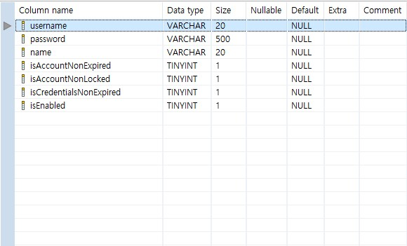
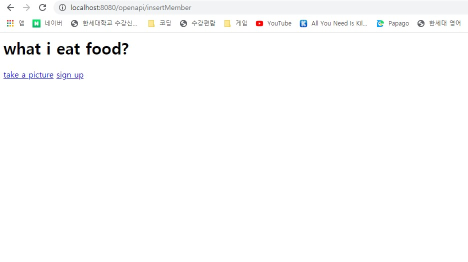
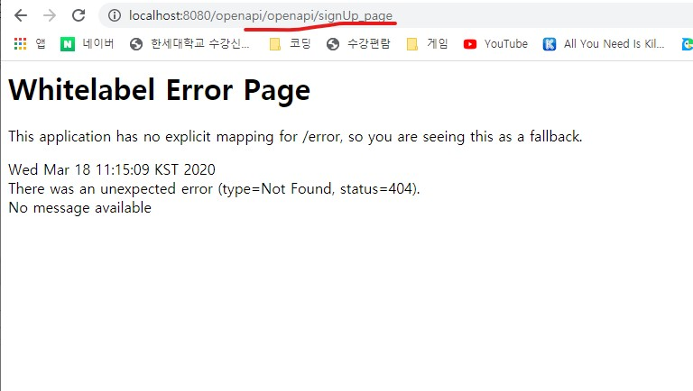

# 에러 모음

## #1

- mybatis의 sql문을 담당하는 xml에서 발생하는 에러코드이다

  ```http
  Whitelabel Error Page
  This application has no explicit mapping for /error, so you are seeing this as a fallback.
  
  Wed Mar 18 10:15:04 KST 2020
  There was an unexpected error (type=Internal Server Error, status=500).
  nested exception is org.apache.ibatis.type.TypeException: Could not set parameters for mapping: ParameterMapping{property='name', mode=IN, javaType=class java.lang.String, jdbcType=null, numericScale=null, resultMapId='null', jdbcTypeName='null', expression='null'}. Cause: org.apache.ibatis.type.TypeException: Error setting non null for parameter #3 with JdbcType null . Try setting a different JdbcType for this parameter or a different configuration property. Cause: java.sql.SQLException: Could not set parameter at position 3 (values was 'aaa') Query - conn:34(M) - "INSERT INTO `user` (`username`, `password`, `name`, `isAccountNonExpired`, `isAccountNonLocked`, `isCredentialsNonExpired`, `isEnabled`) VALUES (?, '?', ?, 1, 1, 1, 1);"
  org.mybatis.spring.MyBatisSystemException: nested exception is org.apache.ibatis.type.TypeException: Could not set parameters for mapping: ParameterMapping{property='name', mode=IN, javaType=class java.lang.String, jdbcType=null, numericScale=null, resultMapId='null', jdbcTypeName='null', expression='null'}. Cause: org.apache.ibatis.type.TypeException: Error setting non null for parameter #3 with JdbcType null . Try setting a different JdbcType for this parameter or a different configuration property. Cause: java.sql.SQLException: Could not set parameter at position 3 (values was 'aaa')
  Query - conn:34(M)  - "INSERT INTO `user` (`username`, `password`, `name`, `isAccountNonExpired`, `isAccountNonLocked`, `isCredentialsNonExpired`, `isEnabled`)
          VALUES (?, '?', ?, 1, 1, 1, 1);"
  	at 
  ```

  

  ```xml
  <?xml version="1.0" encoding="UTF-8"?>
  <!DOCTYPE mapper PUBLIC "-//mybatis.org//DTD Mapper 3.0//EN" "http://mybatis.org/dtd/mybatis-3-mapper.dtd">
  <mapper namespace="com.example.demo.db.repository.UserMapper">
      
      <select id="readUser" parameterType = "String" resultType="member">
          select * from user where username = #{username}
      </select>
  
      <select id="readAuthority" parameterType = "String" resultType="String">
          select authority_name from authority where username = #{username}
      </select>
  
      <insert id="insertMember" parameterType = "member">
          INSERT INTO `user` (`username`, `password`, `name`, `isAccountNonExpired`, `isAccountNonLocked`, `isCredentialsNonExpired`, `isEnabled`)
          VALUES ('#{username ,jdbcType = VARCHAR}',' #{password,jdbcType = VARCHAR}',' #{name,jdbcType = VARCHAR}', 1, 1, 1, 1);    
      </insert>
  
  </mapper>
  ```

- 다음과 같은 코드가 있다고 하자 위 코드는 `insert` 문에서 발생한 에러이다 

- mapping 시키고자 하는 변수 타입과 table에 정의되어 있는 칼럽 타입이 같지 않아서 발생하는 에러이다

- sql에 정의되어 있는 user의 테이블을 확인 해보자



- 다음과 같이 VARCHAR 3개 bool형을 나타내는 TINYINT 4개로 구성되어 있다. 하지만 위 xml에서 VALUES 값으로 넘긴 변수의 타입은 

  ```sql
  VALUES ('#{username ,jdbcType = VARCHAR}',' #{password,jdbcType = VARCHAR}',' #{name,jdbcType = VARCHAR}', 1, 1, 1, 1); 
  ```

  다음과 같다 `'#{username ,jdbcType = VARCHAR}'` 

- 윗 코드를 풀어서 쓴다면 member타입의 변수로 가저온 username이 "aaa" 라면 VALUES에 들어간 값은      '"aaa"' 이다 ' ' 사이에 " "가 또 들어가 버린 셈이다 그래서 위와 같은 코드를 다음과 같이 수정해주면 깔끔하게 table에 insert 된다.

  ```sql
  VALUES (#{username ,jdbcType = VARCHAR}, #{password,jdbcType = VARCHAR}, #{name,jdbcType = VARCHAR}, 1, 1, 1, 1);
  ```


## #2

- 다음 에러는 url이 잘못 됬을때 발생하는 에러이다

 ```http
Whitelabel Error Page
This application has no explicit mapping for /error, so you are seeing this as a fallback.

Wed Mar 18 11:15:09 KST 2020
There was an unexpected error (type=Not Found, status=404).
No message available
 ```

위 에러는 spring boot 의 controller코드에서 발생한 것으로 추정된다 코드를 살펴봤다

```java
package com.example.demo.controller;

import java.util.List;

import com.example.demo.db.model.LoginInfo;
import com.example.demo.db.model.Member;
import com.example.demo.db.service.DBService;
import com.example.demo.db.service.UserService;
import com.example.demo.security.service.CustomUserDetailsService;

import org.springframework.beans.factory.annotation.Autowired;
import org.springframework.stereotype.Controller;
import org.springframework.web.bind.annotation.PathVariable;
import org.springframework.web.bind.annotation.RequestMapping;
import org.springframework.web.bind.annotation.RequestMethod;
import org.springframework.web.bind.annotation.ResponseBody;
import org.springframework.web.bind.annotation.RequestParam;

//어노테이션으로 @Controller를 사용해 IOC에 bean등록 해준다.
@Controller
public class ProjcetController {

    @Autowired
    UserService userService;

    @Autowired
    CustomUserDetailsService detailsService;
    
    @RequestMapping(value="/", method=RequestMethod.GET)
    public String requestMethodName() throws Exception {
        return "/home";
    }
    @RequestMapping(value="/user/upload_picture", method=RequestMethod.GET)
    public String upload_piString() throws Exception {
        return "/user/upload_picture";
    }
    @RequestMapping(value = "/openapi/signUp_page", method = RequestMethod.GET)
    public String signUp_page() throws Exception {
        return "/openapi/signUp_page";
    }

    @RequestMapping(value = "/openapi/predict", method = RequestMethod.GET)
    public String predict_page() throws Exception {
        return "/openapi/predict";  
    }
    @RequestMapping(value="/openapi/insertMember", method=RequestMethod.POST)
    public String inser_member(@RequestParam("id") String id,
                                    @RequestParam("password") String password,
                                        @RequestParam("name") String name) {
        Member member = new Member(id , password , name);
        detailsService.Insert_Member(member);
        return "/home";
    }
}
```

나는 signUp_page에서 제출을 클릭하면 db에 사용자가 입력한 정볼를 insert하는 로직을 구현했다. 그때 브라우저에서 요청한 url은 /openapi/predict 이고 return 페이지는 home이다

이렇게 구현한 이유는 회원가입 처리가 끝나고 `/` url로 이동하라는 의미였다. 그러나 url은 `openapi/insertMember` 이기 때문에 hom.jsp 이후에 다른 url 호출한다면 url경로가 꼬여버린다 다음과 같은 상황 처럼 된다



위 url과 같이 나타나 있고 또 다시 sign up 버튼을 눌러 url를 호출한다면 다음과 같은 오류가 발생 한다



!!!!!! 문제는 그것이다.

```java
    @RequestMapping(value="/openapi/insertMember", method=RequestMethod.POST)
    public String inser_member(@RequestParam("id") String id,
                                    @RequestParam("password") String password,
                                        @RequestParam("name") String name) {
        Member member = new Member(id , password , name);
        detailsService.Insert_Member(member);
        return "/home";
    }
```

return 을 view 페이지를 지정하기 때문에 url은 변경 되지 않고 브라우저에 jsp파일이 출력 된것 이다.

return을 redirect:/ 로 지정을 해 놓으면 redirect:{이동하고 싶은 url 경로} 와 같은 구조로 동작 되기 때문에

**redirect** 를 사용해야 한다!!!

```java
    @RequestMapping(value="/openapi/insertMember", method=RequestMethod.POST)
    public String inser_member(@RequestParam("id") String id,
                                    @RequestParam("password") String password,
                                        @RequestParam("name") String name) {
        Member member = new Member(id , password , name);
        detailsService.Insert_Member(member);
        return "redirect:/";
    }
```

