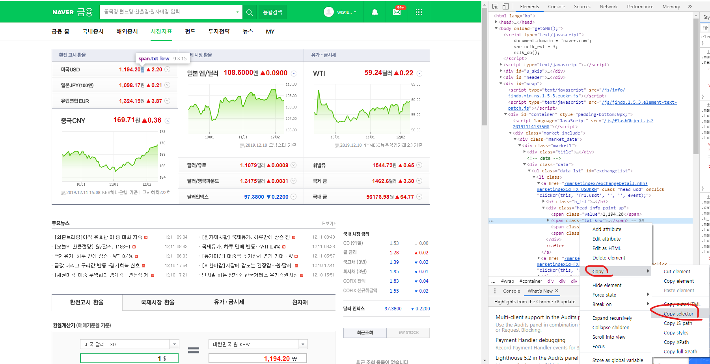

# 크롤링이란

**web** 상에 존재하는 **contents** 를 수집하는 작업 

### BeautifulSoup

```python
from bs4 import BeautifulSoup
import requests
```

두 전처리기를 통해 크롤링을 준비 해준다.

#### 첫번째로 원하는 페이지의 url을 가져와준다.

```python
url = "데이터 수집을 위한 웹 페이지의 url"
responce = requests.get(url)
```

url을 가져와 **import** 한 **requests** 클레스를 사용해 해당 url을 가져온다

requests.get을 통해 url의 데이터를 가져온다
**url**에 접속을 잘했다면 `RESPONSE[200]` 라는 결과 값을 가져온다.

```python
soup = BeauifulSoup(responce.text , "html.parser")
```

requests 메서드를 통해  가져온 url 데이터를 **BeautifulSoup** 에 설정 해준다.

#### 두번째로 원하는 content의 tag값을 가져온다

1. ```python
   soup.find(가져오고싶은 content의 tag값)
   ```

   만약 tag의 속성값을 통해 **content** 를 가져오고 싶다면 **딕션어리** 타입으로

    `("table" , {"class": "table_develop3"})`

   **table** 태그 형식에 **class** 이름이 **table_develop3** 이다. 

2. ```python
   soup.select_one(원하는 id값)
   ```

   **매개변수**로 들어갈 값은 

   

   를 통해 **카피**하고 적용시켜 준다

   ```python
   daller = soup.select_one("#exchangeList > li.on > a.head.usd > div > span.value")
   ```

