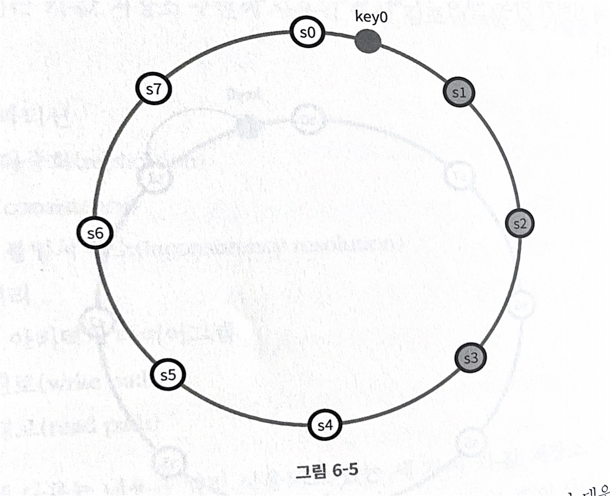

# 카-값 저장소 설계
> 카-값 저장소는 비 관계형 데이터베이스이다. 
> 키-값 사이에서 키는 유일해야 하며 짧으면 짧을수록 좋다. 
> 키-값 사이에서 값은 객체, 리스트, 문자열 등 여러가지의 데이터를 가질 수 있다. 
> 주로 다이나모DB 레디스 등에서 사용한다

## 문제 이해 및 설계 범위 확정
**조건**

- 키-값 쌍의 크기는 10KB 이하이다
- 큰 데이터를 저장할 수 있어야 한다
- 높은 가용성을 제공해야 한다. 따라서 시스템은 설사 장애가 있더라도 빨리 응답해야 한다
- 높은 규모 확장성을 제공해야 한다 따라서 트래픽 양에 따라 자동적으로 서버 증설/삭제가 이루어져야 한다
- 데이터 일관성 수준은 조정이 가능해야 한다.
- 응답 지연시간이 짧아야 한다.

## 단일 서버 키-값 저장소
서버 `한 대` 만 사용한다면 설계하기가 쉽다 모든 데이터를 캐시데이터에 입력시키면 그만인 것이다 그러나 그렇게 된다면 메모리 사용율을 높히며 많은 비용이 생길 수도 있을 뿐더러 캐시 데이터는 원자성을 보장하지 않기 때문에 더 욱 위험하다.

## 분산 키-값 저장소
`수평적` 으로 이루어진 캐시 서버에 값을 분산시키는 방법을 말한다

### CAP 정리
- **C (consistency)**
  - 일관성
  - 분상 시스템에 접속하는 모든 클라이언트는 어떤 노드에 접속했는냐에 따라 관계없이 언제나 같은 데이터를 보게 되어야 한다
- **A (availability)**
  - 가용성
  - 분산 시스템에 접속하는 클라이언트는 일부 노드에 장애가 발생하더라도 항상 응답을 받을 수 있어야 한다.
- **P (partition tolerance)**
  - 파티션 감내
  - 파티션은 두 노드 사이에 통신 장애가 발생하였음을 의미한다. 파티션 감내는 네트워크에 파티션이 생기더라도 시스템은 계속 동작하여야 한다는 것을 뜻한다.

-----
이 `CAP 정리` 에선 불편의 법칙이 있다. 그건 3가지 원칙을 모두 가질 수 없다는 점

예를 들면
- CP 시스템
  - 일관성과 파티션 감내를 지원하는 키-값 저장소. 가용성을 희생한다
  - > ex) 은행에서 분산 키값 저장소 중 하나의 파티션이 에러가 났을때 가용성을 희생한다면 빠르게 데이터를 처리하는 은행 특성상 최신의 데이터를 클라이언트에게 제공해야 하는 의무가 있다. 돈을 이체 신청 했는데 일관성 때문에 해당 기능을 막아버리면 큰 문제가 발생 하게 된다
- AP 시스템
  - 가용성과 파티션 감내를 지원하는 키-값 저장소. 데이터 일관성을 희생한다.
  - > ex) CP 시스템과 마찬가지고 은행에서 데이터 일관성을 희생했을 떈 이체 등 통상적인 서비스는 가능하지만 보여지는 데이터가 이전(낡은) 데이터 이므로 문제가 생긴다.
- CA 시스템
  - 일관성과 가용성을 지원하는 키-값 저장소. 파티션 감내는 지원하지 않지면 통상 `네트워크 장애`는 피할 수 없으므로 CA 시스템 설계는 `존재하지 않는다`

## 시스템 컴포넌트
> 키-값 저장소에 구현될 핵심 컴포넌트 및 기술

- 데이터 파티션
- 데이터 다중화 (replication)
- 일관성 (consistencey)
- 일관성 불일치 해소
- 장애처리
- 시스템 아키텍처 다이어그램
- 쓰기 경로
- 읽기 경로

### 데이터 파티션
데이터를 파티션으로 나눌 때 안정 해시를 사용해 원형 해시 링에 파티션을 분배 하고 데이터를 읽기/쓰기 할때 해시화 된 데이터에서 시계방향으로 가장 가까운 서버에서 값을 읽기/쓰기 하는 방식

**장점**
- 규모가 확장 되거나 축소 되었을때 데이터의 원자성을 보장
- 가상 노드를 사용해서 다양성 증대 (**이건 다시 찾아 봐야 함**)

### 데이터 다중화
데이터 다중화는 원형 해시 링에 데이터를 다룰 때 저장 될 서버 이후 서버에 사본을 본사해 저장 하는 것을 의미 한다.

이떄 사용되는 기술 주 하나는 정족수 합의 프로토콜을 사용하면 데이터의 일관성을 입증 할 수 있다

### 데이터 일관성
정족수 프로토콜을 예를 들면

- N: 데이터가 활용된 사본 갯수
- W: 쓰기 연산에 대한 정족수 ( 성공 response 값)
- R: 읽기 연산에 대한 정족수 ( 성공 response 값)

이떄 프로토콜 규칙은
- R=1, W=N : 빠른 읽기 연산에 최적화 된 시스템
- W=1, R=N : 빠른 쓰기 연산에 최적화 된 시스템
- W+R > N : 강한 일관성
- W+R < N : 약한 일관성